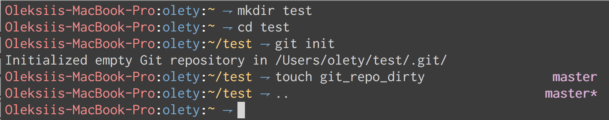

# Themety

Cross-platform desktop theme system. Shell prompt + full Linux rice + macOS theme sync.



## Structure

```
shared/     Cross-platform: fish prompt, fish theme, zsh theme, Claude statusline
linux/      Full niri rice: matugen, niri, waybar, ghostty, foot, eww, mako, fuzzel, scripts
macos/      Theme sync daemon (Swift + launchd)
```

## Install

### Linux (full rice)

```sh
git clone git@github.com:olety/themety.git ~/code/themety
cd ~/code/themety && linux/install.sh
```

Creates symlinks from `~/.config/*` and `~/.local/bin/*` into the repo. Edits to live configs are edits to the repo.

**Dependencies:** niri, waybar, matugen, ghostty, foot, eww, mako, fuzzel, awww

### macOS (prompt + theme sync)

```sh
git clone git@github.com:olety/themety.git ~/code/themety
cd ~/code/themety && macos/install.sh
```

Installs fish/zsh prompt + Swift daemon that syncs Claude Code theme with macOS appearance.

Requires Xcode CLI tools (`xcode-select --install`).

### Shared only (prompt on any machine)

```sh
shared/install.sh
```

## Palettes

Two fixed palettes. No dynamic wallpaper color extraction.

| | Dark: Tomorrow Night Eighties | Light: Solarized Light |
|---|---|---|
| bg | `#2d2d2d` | `#fdf6e3` |
| fg | `#cccccc` | `#657b83` |
| accent | `#6699cc` | `#268bd2` |
| error | `#f2777a` | `#dc322f` |

## Shell Prompt

`hostname:user:path ⇀ [branch*]` — SSH-aware separator color, git branch + dirty indicator.

Works in zsh (oh-my-zsh), fish, and as a Claude Code statusline.

## Linux Rice

Full niri Wayland compositor setup:

- **matugen** — template engine for dark/light mode switching (fixed palettes, conditional templates)
- **niri** — tiling Wayland compositor, 1px accent borders, easeOutQuint animations
- **waybar** — status bar with dynamic accent colors
- **ghostty** — primary terminal, auto dark/light theme switching
- **foot** — fallback terminal, matugen-templated config
- **eww** — desktop clock widget (Cormorant Garamond)
- **mako** — notifications, accent-bordered
- **fuzzel** — app launcher
- **whisrs** — voice recording overlay (GTK4 layer-shell)

Theme switching: `theme-switch dark` / `theme-switch light` or automatic via systemd timers.

Wallpaper: `Mod+Shift+W` opens fuzzel picker, wallpaper-set handles awww + matugen re-run.

## macOS Theme Sync

`themety-sync` watches `AppleInterfaceThemeChangedNotification` and keeps Claude Code's `~/.claude.json` theme key in sync. Re-applies if Claude overwrites it.

Runs as a launchd agent — starts on login, restarts on crash.

Needs: System Settings > Appearance > Auto.
